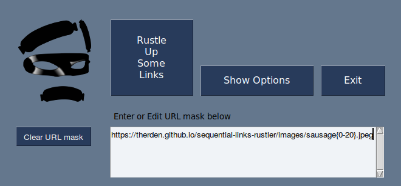
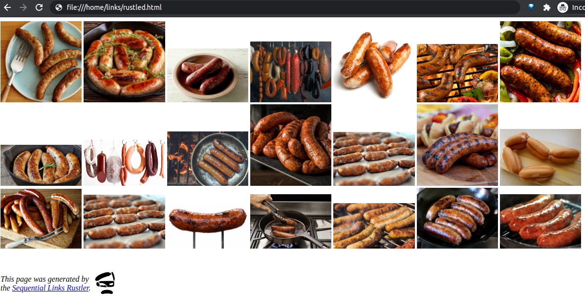
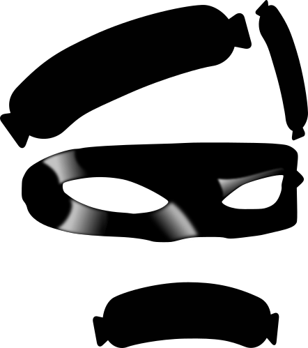

# Sequential Links Rustler

*Prepares and presents them tasty links just the way you like*

Website pages sometimes contain links -- other web pages, or image, video,
sound, or text files -- for which the files and/or directories are named using
numeric sequences.

When the design or organization of those pages makes accessing those resources a
chore, you might want to generate your own HTML page with links to a selected
subset of those resources.

That's where `Sequential Links Rustler` comes in.

Getting Started
---------------
1.  Clone this repository, or download and extract [this zip file](https://github.com/therden/sequential-links-rustler/archive/refs/heads/main.zip)
2.  Change to the directory containing these files
3.  Run `python slr.py` or `python3 slr.py`
4.  In the GUI, fill in the URL mask (see examples below<!--, and more [here](`https://therden.github.io/sequential-links-rustler/-->) and click the button labeled _Rustle Up Some Links_, <!--set any desired options,--> then sit back and wait (not long!) for your new web page to load.

<figure>

</figure>

Basic Usage
-----------
`Sequential Links Rustler` takes a __"URL mask"__ containing at least one __"range definition"__ and generates an HTML page with links to the set of resources that were specified, opening it in a new browser tab.

A __URL mask__ is just a standard URL, except that in one or more portions a numeric value has been replaced by __range definition__.

A __range definition__ is written within curly brackets, and at a minimum consists of a Start integer and a Stop integer separated by a hyphen.  `Sequential Links Rustler` calculates the set of values described by the __range definition__ and then generates a series of links, each of which replaces the __range definition__ with the next value in the set.

If the Stop value is larger than the Start value then, by default, the value inserted into each generated link be one greater than the last.

For example: the URL mask 
`https://therden.github.io/sequential-links-rustler/images/sausage{0-20}.jpeg` 
contains the range definition `{0-20}` and produces and loads an HTML page that looks like

<figure>

</figure>

If the Stop value is smaller than the Start value, then the value inserted in each link will be one less than the last.  So the mask  
`https://therden.github.io/sequential-links-rustler/images/sausage{20-0}.jpeg`  will generate the same page as is shown above, but with the images in reverse order.

These +1 or -1 values are referred to as the __range definition__'s "stride" -- the distance between one value and the next.  

`Sequential Links Rustler` supports "strides" longer than 1.  When desired, these are specified within the __range definition__ by following the Stop value with a semi-colon and an integer representing the desired "stride".  (It will be interpreted as positive or negative depending on the Stop and Start values in the __range definition__.)

| range definition | set of values produced |
| ---------------- | ---------------------- |
| {0-9; 2} | 0, 2, 4, 6, 8 |
| {0-9; 3} | 0, 3, 6, 9 |
| {9-0; 2} | 9, 7, 5, 3, 1 |
| {9-0; 3} | 9, 6, 3, 0 |

Other Features
---------------

- zero padding
    - the range definition `{01-10;1}` will produce links with the values `01, 02, 03, 04, 05, 06, 07, 08, 09, 10`
    the range definition `{001-010}` will produce links with the values `001, 002, 003, 004, 005, 006, 007, 008, 009, 010`
- multiple range definitions within a single URL mask
    - copy the following into `Sequential Links Rustler` and hover over the images in order to see how the three range definitions are processed recursively, left-to-right.
    `https://therden.github.io/sequential-links-rustler/levels/gallery{01-03;1}/set{1-2;1}/thumbnail_{3-0;-1}.jpeg`

Other example URL-masks
-----------------------
- `https://therden.github.io/sequential-links-rustler/png_numbers/{5-0;-1}.png`
- `https://therden.github.io/sequential-links-rustler/png_numbers/{100-120;4}.html`
- `http://vision.stanford.edu/aditya86/ImageNetDogs/thumbnails/n02098286-West_Highland_white_terrier/n02098286_{0-6516;1}.jpg`
<!--- `https://evolution.voxeo.com/library/audio/prompts/numbers/{0-10;1}.wav`-->

ToDo
----
I'm tracking ideas for features and improvements (along with bugs) in this repo's [Issues](https://github.com/therden/sequential-links-rustler/issues) -- feel free to make your own contributions.

Speaking of contributions
-------------------------
It isn't required (of course), but if you find this project useful and are so moved, you can

__Buy Me a Coffee__ is a great way to publicly support creators.  It's quick, easy, and your contribution is recorded so that others can see that you've made a contribution.  (You can choose to make your donation private if you prefer.)

Credits
-------

Thanks to [MikeTheWatchGuy](https://github.com/MikeTheWatchGuy) for creating and maintaining [PySimpleGUI](https://github.com/PySimpleGUI/PySimpleGUI).

And also to Quinn for his encouragement (constructive criticism to come?)

The source of the three black sausages incorporated into the image of "the Rustler" was the SVG at [Sausage by Jacob Halton from the Noun Project](https://thenounproject.com/term/sausage/4135/)

<!--
WAV files for 'Countdown' example from Evolution/Voxeo's [open source (LPGL) 'Numbers' audio prompts library in open source (LPGL) tools library](https://evolution.voxeo.com/library/audio/prompts/)
-->
