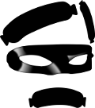

# Sequential Links Rustler

<!--  -->

<figure>

</figure>

*Prepares and presents them tasty links just the way you like*

Website pages sometimes contain links -- other web pages, or image, video,
sound, or text files -- for which the files and/or the directories they're
stored in have been named using numeric sequences.

When the design or organization of those pages makes it a chore to access those
resources, you might want to generate your own HTML page with links to a
selected subset of those resources.

That's where __Sequential Links Rustler__ comes in.

Getting Started
---------------
0.  (You will need to have Python 3 installed on your system.)
1.  Clone this repository, or download and extract [this zip file](https://github.com/therden/sequential-links-rustler/archive/refs/heads/main.zip)
2.  Change to the directory containing these files
3.  Run `python slr.py` or `python3 slr.py`
4.  In the resulting GUI dialog
    - fill in the URL mask -- see examples below and [here](https://therden.github.io/sequential-links-rustler),
    - change options (if desired),
    - click _Rustle Up Some Links_, and then
    - sit back and wait (not long!) for your new web page to load.

<figure>

</figure>

Basic Usage
-----------
__Sequential Links Rustler__ accepts a __"URL mask"__ and generates an HTML page with links to the specified resources, opening the resulting file in your chosen browser.

A __URL mask__ is like a standard URL, except that one or more numeric values have been replace with __"sequence definitions"__.

A minimal __sequence definition__ consists of a *Start* integer and a *Stop* integer, separated by a hyphen and surrounded by curly brackets.  

Each link generated by __Sequential Links Rustler__ consists of the URL mask, with a value generated from the sequence definition replacing that sequence definition. For example, in the URL mask

`https://therden.github.io/sequential-links-rustler/images/sausage{0-20}.jpeg`

the sequence definition is `{0-20}`. From this URL mask, __Sequential Links Rustler__ will produce and load an HTML page that looks like

<figure>

</figure>

Special features for image links
--------------------------------
- __Specify the size of thumbnail images as % of browser window or in pixels__

- __Choose whether to hide or display links to inaccessible image files__
<!-- - #### Specify a separate URL mask for thumbnail images from full-size images -->

Other Features
---------------
<!-- - #### Choose the location where the generated HTML file will be saved -->
<!-- - #### Choose name of the generated HTML file that's generated -->
- __Choose the browser in which the generated HTML file will open__

- __Advanced "sequence definition" features__
    -  zero padding of values
    -  declining values within a sequence
    -  custom intervals between values
    -  including multiple sequence definitions within a single URL mask

For detailed information about these options, and more example URL masks, see [the GitHub pages associated with this project](https://therden.github.io/sequential-links-rustler/).

ToDo
----
I track bugs and ideas for improvements and new features in [Issues](https://github.com/therden/sequential-links-rustler/issues) -- feel free to contribute your thoughts there.

Speaking of contributions
-------------------------
It isn't required (of course), but if you find this project useful and are so moved, you can

__Buy Me a Coffee__ is a great way to publicly support creators.  

It's quick, easy, and (unless you choose otherwise) your contribution is recorded and made visible so you'll get credit for it.

Credits
-------
Speaking of credit...

My sincere thanks to

- [MikeTheWatchGuy](https://github.com/MikeTheWatchGuy), for creating and maintaining [PySimpleGUI](https://github.com/PySimpleGUI/PySimpleGUI).

- [Quinn](https://github.com/QuinnHerden), for love, laughs, and encouragement.

- Jacob Halton, for the three black [Sausage (from the Noun Project)](https://thenounproject.com/term/sausage/4135/), which I abused dreadfully in creating the image of "The Rustler".

<!--
WAV files for 'Countdown' example from Evolution/Voxeo's [open source (LPGL) 'Numbers' audio prompts library in open source (LPGL) tools library](https://evolution.voxeo.com/library/audio/prompts/)
-->
