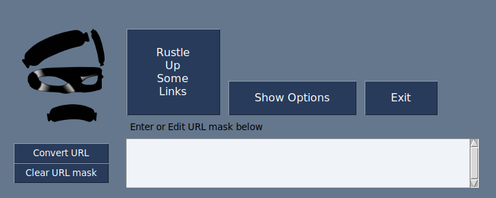

# Sequential Links Rustler

*Prepares and presents them tasty links just the way you like*

Website pages sometimes contain links -- other web pages, or image, video,
sound, or text files -- for which the files and/or directories are named using
numeric sequences.

When the design or organization of those pages makes accessing those resources a
chore, you might want to generate your own HTML page with links to a selected
subset of those resources.

That's where `Sequential Links Rustler` comes in.

Getting Started
---------------
1.  Clone this repository, or download and extract [this zip file](https://github.com/therden/sequential-links-rustler/archive/refs/heads/main.zip)
2.  Change to the directory containing these files
3.  Run `python slr.py` or `python3 slr.py`
4.  In the GUI, fill in the URL mask (see examples below,<!--, and more [here](`https://therden.github.io/sequential-links-rustler/-->) then click the button labeled _Rustle Up Some Links_, <!--set any desired options,--> then sit back and wait (not long!) for your new web page to load.

<figure>

</figure>

Basic Usage
-----------
`Sequential Links Rustler` accepts a __"URL mask"__ and generates an HTML page with links to the set of resources that were specified, opening it in a new browser tab.

A __URL mask__ is a standard URL except that a __range definition__ has been substituted for a numeric value.

A minimal __range definition__ consists of a *Start* integer and a *Stop* integer, separated by a hyphen and surrounded by curly brackets.

For example: in the URL mask

`https://therden.github.io/sequential-links-rustler/images/sausage{0-20}.jpeg`

the range definition is `{0-20}`, and from it `Sequential Links Rustler` will produce and load an HTML page that looks like

<figure>

</figure>

Changing the __range definition__ in the above example to `{20-0}` will generate the same page as is shown above, except that the order of the images will be reversed.

`Sequential Links Rustler` can generate sequences in which successive values differ by more than 1.  Between the *Stop* value and the closing curly bracket, insert a semi-colon and an integer representing the difference between consecutive values you desire.

| range definition | set of values produced |
| ---------------- | ---------------------- |
| {0-9;2}          | 0, 2, 4, 6, 8          |
| {0-9;3}          | 0, 3, 6, 9             |
| {9-0;2}          | 9, 7, 5, 3, 1          |
| {9-0;3}          | 9, 6, 3, 0             |

Other Features
---------------
- zero padding:
| range_definition | sequence                |
| ---------------- | ----------------------- |
| {01-20;5}        | 01, 06, 11, 15          |
| {020-001; 4}     | 020, 016, 012, 008, 004 |

- multiple range definitions:

  for example, given the (partial), 3-level URL_mask `set{1-2}/subset{11-12}/pic{0-2}.jpg` `Sequential Links Rustler`
  will produce the (partial) link sequence
  - set1/subset11/pic0.jpg 
  - set1/subset11/pic1.jpg 
  - set1/subset11/pic2.jpg 
  - set1/subset12/pic0.jpg 
  - set1/subset12/pic1.jpg 
  - set1/subset12/pic2.jpg 
  - set2/subset11/pic0.jpg 
  - set2/subset11/pic1.jpg 
  - set2/subset11/pic2.jpg 
  - set2/subset12/pic0.jpg 
  - set2/subset12/pic1.jpg 
  - set2/subset12/pic2.jpg 

Other example URL-masks
-----------------------
- `https://therden.github.io/sequential-links-rustler/png_numbers/{5-0;-1}.png`
- `https://therden.github.io/sequential-links-rustler/png_numbers/{100-120;4}.html`
- `http://vision.stanford.edu/aditya86/ImageNetDogs/thumbnails/n02098286-West_Highland_white_terrier/n02098286_{0-6516;1}.jpg`
<!--- `https://evolution.voxeo.com/library/audio/prompts/numbers/{0-10;1}.wav`-->

ToDo
----
I'm tracking ideas for features and improvements (along with bugs) in this repo's [Issues](https://github.com/therden/sequential-links-rustler/issues) -- feel free to make your own contributions.

Speaking of contributions
-------------------------
It isn't required (of course), but if you find this project useful and are so moved, you can

__Buy Me a Coffee__ is a great way to publicly support creators.  It's quick, easy, and your contribution is recorded so that others can see that you've made a contribution.  (You can choose to make your donation private if you prefer.)

Credits
-------

Thanks to [MikeTheWatchGuy](https://github.com/MikeTheWatchGuy) for creating and maintaining [PySimpleGUI](https://github.com/PySimpleGUI/PySimpleGUI).

And also to Quinn for his encouragement (constructive criticism to come?)

The source of the three black sausages incorporated into the image of "the Rustler" was the SVG at [Sausage by Jacob Halton from the Noun Project](https://thenounproject.com/term/sausage/4135/)

<!--
WAV files for 'Countdown' example from Evolution/Voxeo's [open source (LPGL) 'Numbers' audio prompts library in open source (LPGL) tools library](https://evolution.voxeo.com/library/audio/prompts/)
-->
